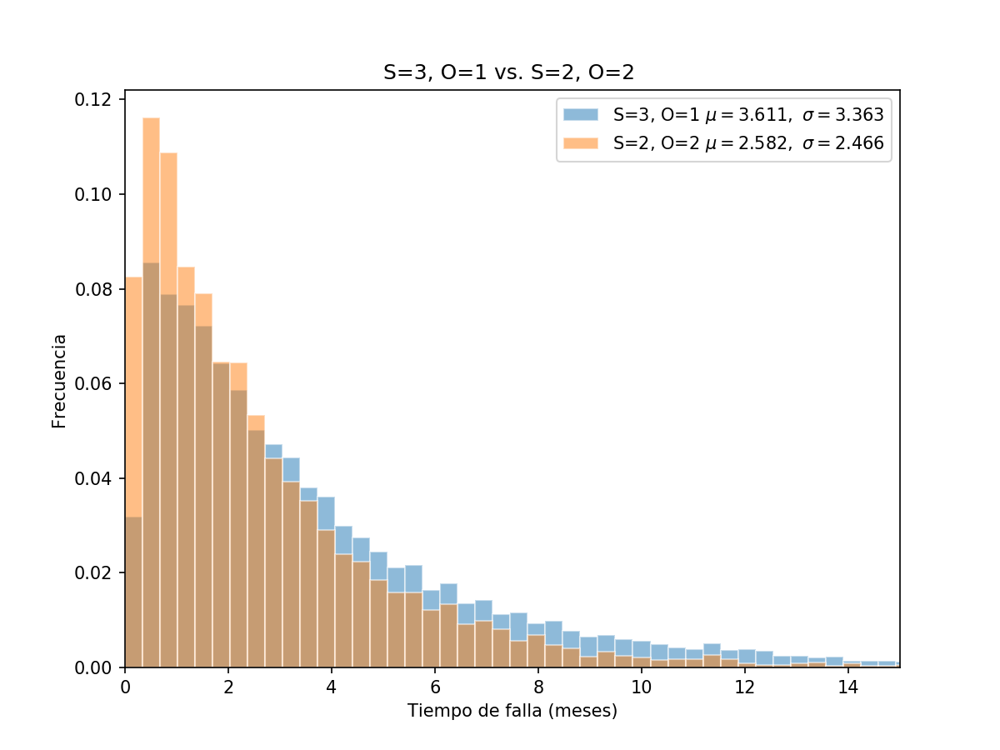

# Trabajo Final de Modelos y Simulación
## FaMAF - 2017

### Estudiantes:


#### **Francisco Trucco, Juan Scavuzzo**


<div class="page-break"></div>

# Introducción


## Situación
Se tiene un lavadero con una cierta cantidad de máquinas que deben estar
funcionando en todo momento para que el lavadero sea operativo. Dado que las
máquinas se descomponen cada una cierta cantidad de tiempo, resulta relevante
poder predecir el tiempo que tarda el sistema en fallar y determinar si es mejor
aumentar la cantidad de máquinas de repuesto o aumentar la cantidad de operarios
que las reparen.


Claramente, determinar analíticamente el tiempo medio que tarda el sistema en
fallar es muy dificil.
Por esto es que se realizaron simulaciones para determinar el tiempo medio, y la
desviación estándar, que transcurre hasta que el lavadero deja de ser operativo.

Por otra parte, estas simulaciones permiten determinar si es más conveniente
aumentar la cantidad de máquinas de repuesto o la cantidad de operarios.
<br>
<br>


## Modelo

El lavadero cuenta con **N** máquinas lavadoras en servicio y **S** máquinas
de respuesto, todas ellas de idéntica marca, modelo y antigúedad.
Por otra parte, el lavadero cuenta con los servicios de técnicos que reparan
las máquinas en simultáneo entre sí pero cada uno de manera secuencial, cuando
éstas se rompen.

Todos los tiempos de funcionamiento de las máquinas hasta descomponerse son
variables aleatorias independientes exponenciales con un tiempo medio de fallar
de **T<sub>r</sub>**,

El tiempo de reparación de una máquina que ingresa al taller es una variable
exponencial con tiempo medio igual a **T<sub>f</sub>**, independiente de todos los
anteriores.

Se dice que el sistema falla cuando se tiene menos de N máquinas funcionando en un
momento dado o, equivalentemente, cuando posee más de S máquinas defectuosas en el
taller de reparación.


Para resolver el problema en cuestión, se desarrolló un algoritmo que simula la
relación que se establece entre los lavarropas que se rompen, aquellos que se
están arreglando y los lavarropas de repuesto.

En esta simulación se considera un 'evento' cuando se rompe una máquina o
cuando se termina de arreglar una.

Entonces, si se rompe una máquina, y no puede ser atendida por el técnico
porque éste está arreglando otra, ésta se considera en la cola de espera para
ser atendida.
Una vez que un operario termina de arreglar un máquina, o bien comienza a
reparar otra o bien se considera "libre".

<div class="page-break"></div>

# Algoritmo y descripción de las Variables

En este trabajo se desarrolló un algoritmo implementado en python que generaliza
la idea de el problema propuesto.
El algoritmo retorna el tiempo que pasa hasta que el sistema deja de ser
operativo, dada una cantidad arbitraria de técnicos reparadores, máquinas de
repuesto, máquinas que deben estar funcionando en todo momento.

Los parámetros del algoritmo son, entonces:

- **N**: Cantidad de máquinas que deben estar funcionando en todo momento.
- **S**: Cantidad de máquinas de repuesto.
- **T<sub>f</sub>**: Tiempo medio de falla de una máquina.
- **T<sub>r</sub>**: Tiempo medio de reparación de una máquina por un operador.
- **O**: Cantidad de operadores que reparan las máquinas.


Para generar los tiempos de retardo de los eventos, se definieron las siguientes
funciones auxiliares:

- Tanto el tiempo de falla de una máquina como el tiempo que tarda
un operario en arreglar una máquina, tienen distribución exponencial con
media **Tf** y **Tr** respectivamente.


Por otro lado, se utilizaron las siguientes variables:

- **t**: Tiempo actual.

- **fails**: Lista de los tiempos de fallos de máquinas. Está ordenada de menor
             a mayor.
- **t_fixed**: Lista de los tiempos en los que se finalizan los arreglos de las
               máquinas. Si hay un valor igual a `inf` significa que existe un
               operario libre.

- **fixing**: Cantidad de operarios que están arreglando máquinas. O
              equivalentemente, la cantidad de máquinas que están siendo
              arregladas.
- **broken**: Cantidad de máquinas que están rotas (incluye aquellas que están
              siendo arregladas).
La cantidad de máquinas a arreglar se calcula como `broken - fixing`


El algoritmo completo es el siguiente:

<div class="page-break"></div>


```python
def simulation(n, spare, Tf, Tg, oper):
    inf = float('inf')
    fails = [random_fail() for i in range(n)]
    fails.sort()
    t = 0
    broken = 0
    fixing = 0
    # 'oper' operarios
    t_fixed = [inf] * oper

    while True:  # Mientras funcione la lavandería

        if fails[0] < t_fixed[oper - 1]: # Un lavarropas ha fallado
            t = fails[0]
            broken += 1

            # Si no hay lavarropas de repuesto la lavandería deja de funcionar
            if broken >= spare + 1:
                return t

            # Tomar un lavarropa de repuesto y reemplazar el viejo
            if broken < spare + 1:
                fails[0] = t + random_fail()
                fails.sort()  # Siempre se ordenan de menor a mayor tiempo

            # Si hay operarios libres ponerlos a trabajar con los lavarropas
            # rotos
            i = 0
            while broken > fixing and t_fixed[i] == inf:
                t_fixed[i] = t + random_fix()
                fixing += 1
                i += 1
            t_fixed.sort(reverse=True)

        else: # Un operario ha terminado de arreglar un lavarropa
            t = t_fixed[oper - 1]
            broken -= 1
            fixing -= 1

            # Si no hay lavarropas por arreglar, el operario queda libre
            if broken == fixing:
                t_fixed[oper - 1] = inf

            # Si hay lavarropas por arreglar, poner el operario a arreglar el
            # lavarropas
            if broken > fixing:
                t_fixed[oper - 1] = t + random_fix()
                fixing += 1
            t_fixed.sort(reverse=True)
```


<div class="page-break"></div>

# Resultados

En todos los casos, se realizaron 10000 simulaciones para calcular la media
y la desviación estándar. Con los resultados de estas simulaciones es que se
contruyeron los distintos histogramas que se presentarán a continuación.

Dado el contexto del problema, resulta de gran interés saber cómo maximizar el
tiempo que tarda el sistema en fallar. Para ésto, los parámetros más
significativas son **spare** y **oper** ya que éstos son los que el dueño del
local modficaría para maximizar sus ganancias.

Es por ésto que los parámetros que se pusieron en comparación son los
anteriormente nombrados.

Los tres experimentos realizados utilizaron los siguientes parámetros:
  - 2 máquinas de repuesto y 1 operarios
  - 2 máquinas de repuesto y 2 operarios
  - 3 máquinas de repuesto y 1 sólo operario.

Por otro lado, la estructura de los histogramas es la siguiente:
- **Eje x**: Representa el tiempo, en meses, en el que falla el sistema.
- **Eje y**: Representa la frecuencia del tiempo que tarda el sistema en fallar.
En la esquina superior derecha se puede observar la media y la desviación
estándar resultante del experimento.

A continuación, se presentan los histogramas correspondientes a cada
experimento:

<div class="page-break"></div>

## Dos máquinas de repuesto y sólo un operario
En este caso, realizamos 10000 simulaciones asumiendo que hay 2 máquinas de
repuesto (spare = 2) y sólo un operario (oper = 1).
- **Media**: 1.765
- **Desviación estándar de la media**: 0.01621


<div class="page-break"></div>
## Dos máquinas de repuesto y dos operarios

En este caso, realizamos 10000 simulaciones asumiendo que hay 2 máquinas de
repuesto (spare = 2) y dos operarios (oper = 2)
- **Media**: 2.555
- **sigma**: 0.02402


<div class="page-break"></div>

## Tres máquinas de repuesto y sólo un operario

En este caso, realizamos 10000 simulaciones asumiendo que hay 3 máquinas de
repuesto (spare = 3) y sólo un operario (oper = 1)

- **Media**: 3.575
- **Desviación estándar de la media**: 0.0301


<div class="page-break"></div>

## Comparación: Agregar un operario

En este caso, realizamos una comparación de la situación en que el lavadero
tiene 2 máquinas de repuesto y 1 sólo operario con la situación en que tiene 2
máquinas de repuesto y 2 operarios.
<br>
<br>
Podemos observar que cuando se agrega un operario el tiempo esperado de falla
del sistema aumenta considerablemente.

Este resultado es el que esperábamos, pues aumenta la velocidad de
reparación de máquinas al aumentar la cantidad de individuos capaces de reparar
al mismo tiempo.


<div class="page-break"></div>

## Comparación: Agregar una máquina

En este caso, realizamos una comparación de la situación en que el lavadero
tiene 3 máquinas de repuesto y 1 sólo operario con la situación en que tiene 2
máquinas de repuesto y 2 operarios.
<br>
<br>
Podemos observar que adquirir una máquina más de repuesto es más conveniente
que contratar un operario extra pues el tiempo medio de falla del sistema aumenta.


Se puede ver en el histograma que la probabilidad de que el sistema falle
dentro de los primeros 2 meses es considerablemente superior en el caso de que
se contrata a un nuevo operario.




<div class="page-break"></div>

## Comparación: entre todos

En este caso, realizamos una comparación de las tres situaciones antes
mencionadas.

Como es esperado, tanto agregar un operario como una máquina de repuesto aumenta
el tiempo medio de falla del sistema.

Por otra parte, es notorio que la distribución de probabilidades parace aumentar
su dispersión a medida que se agregan operarios y se agregan máquinas.


<div class="page-break"></div>

# Conclusión

Se presentó el problema de determinar el tiempo de falla esperado de un lavadero
en función de la cantidad de operarios y lavarropas de repuesto. Se construyó un
modelo y a partir del mismo se obtuvieron datos simulados correspondientes al
tiempo de falla del sistema. Dado que resulta de gran interés saber cómo
maximizar el tiempo que tarda el sistema en fallar en función de estos
parámetros, los distintos experimentos realizados varían estos parámetros.

Agregar una máquina de repuesto incrementa el tiempo medio de fallo del sistema
en un 50%. Agregar un operario incrementa el tiempo medio de fallo del sistema
en un 107%. Claramente, agregar una máquina aumenta más el tiempo medio de fallo
del sistema que agregar un operario. Estos resultados no deben extrapolarse a
otras situaciones en las cuáles los parámetros sean distintos (ver Resultados).

Es importante destacar que el algoritmo propuesto puede ser útil para realizar
otros experimentos modificando los parámetros del mismo.
